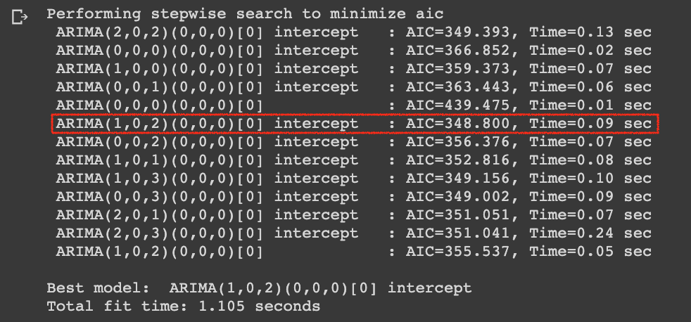
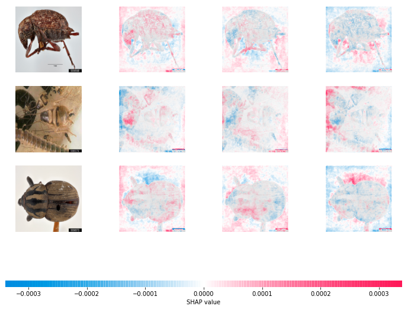
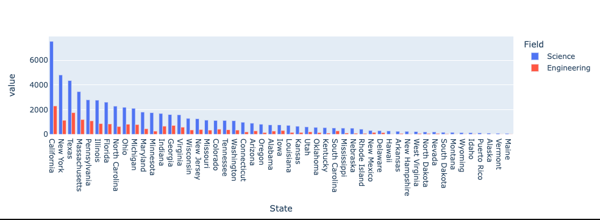

## Final Project - Covid-19 Forecasting

The rapid spread of the COVID-19 pandemic has raised huge concerns about the potential consequences of a health disaster that would result in a huge number of deaths. Although it is difficult to make accurate predictions of the number of deaths as a result of the COVID-19 disease, this prediction is crutial for public health authorities to make the most reliable decisions and establish the necessary precautions to protect people's lives. In this project, we present an approch for predicting the number of deaths from COVID-19 at the region level. This analysis requires modeling and comparing the number of COVID-19 deaths using both univariate and multivariate time-series analysis. The proposed approach was assessed on official data provided by federal agencies, including NIH, public consortia, and private entities. We hope the result of our computational analysis sheds light on the how time-series forecasting models can play a role in predicting number of deaths.  

### Data

Below are the two main data sources used in the analysis: 

* _[Open-Access Data and Computational Resources to Address COVID-19](https://datascience.nih.gov/covid-19-open-access-resources)_

Summary of the dataset: COVID-19 open-access data and computational resources are being provided by federal agencies, including NIH, public consortia, and private entities. These resources are freely available to researchers, and this page will be updated as more information becomes available. 

* _[Amazon Web Services (AWS) data lake for analysis of COVID-19 data](https://covid19.ncdhhs.gov/dashboard/data-behind-dashboards)_

Summary of the dataset: NCDHHS has provided the following data from our NC COVID-19 dashboards: Daily Cases and Deaths Metrics, Daily Testing Metrics, County Cases and Deaths, ZIP Code Cases and Deaths, Demographics, Cases Demographics, Outbreaks and Clusters, PPE, Hospital Patient Data, Hospital Beds and Ventilators, Hospitalization Demographics, Vaccinations - Doses by County, People Vaccinated by County and People Vaccinated Demographics.

After examining the data sources, we decided to mainly focus on the three datasets: `AWS_casesDHPC`, `DHHS_HOSPITAL_BEDS_VENTILATORS_REGION`, and `DHHS_HOSPITAL_METRICS_REGION` to conduct the analysis of interest. 

Since we are interested in the region level analysis, specifically, we want to predict the number of COVID-19 deaths in the Duke Healthcare Preparedness Coalition (DHPC) per week. Therefore, the unit of analysis for the project was determined to be : `Number of COVID-19 deaths in DHPC / week`. 

### Data Preprocessing 

We used Google Colab to perform the analysis since it was a collaborative effort. 

* Drop unnecessary columns
* Convert date column to the weekly format
* Slice the dataframe to only the DHPC Coalition
* Merge datasets (cases/deaths, hospital beds, hospital metrics) based on the date (week) and coalition of interest

The majority of the steps are fairly standard, and the Colab notebook for the analysis is linked at the end of the post for those who are interested in the details. 

For handling missing values, we followed two steps. We noticed that the majority of the data points are missing during the early stage of COVID data collection (before June, 2020), possibly due to the limitation in the tools and labor. Therefore, we decided to chop the first 3 months of data, which leaves us everything starting from June-2020 up until this month (November 2021) for the analysis. After dropping these rows with null values, we noticed that there are still a small portion of missing values in the `Hospitalized and Ventilated COVID Inpatient Count` column. Considering the missing values exist in the rows with the earliest date where hospitalized inpatient count was relatively low comparing to later time, we filled the NA values with 0 beore proceeding with the analysis. 

### EDA - Visualizing Time-Series

Using the `pandas_profilling` package, we examined summary statistics of the final dataframe, including correlations between columns, missing value percentage, distinct values, mean values, etc.

This plot below shows a weekly trend for each variable from the June, 2020 to November, 2021. The numbers on the x axis are the week numbers, which represents the transformed version of the date variable. The y axis shows the count of each variable corresponding to the weeks. It seems like there's a seasonal trend for `Hospitalizations` (shown in blue). Since our variable of interest is `Deaths (daily growth)` (shown in orange), which is hard to tell from this overall plot, we will examine it more closely in the later.


Since we are also interested to see the difference between conducting time-series multivariate analysis with different levels of feature correlation, we also plotted a heap map to visualize the correlations across all features in the dataset. 

In the heatmap, we set a threshold of 0.5 to differentiate features that are highly correlated with deaths and those that have low correlation with deaths. The index are only present for those with a correlation of 0.5 or higher across the features. 


Based on the results of the heatmap, we will explore 3 approahces to the multivariate model, which are: model with all features, with features highly correlated with deaths, and with features with low correlation to deaths. 

### Building a Time-Series Forecasting Model

We are interested to model COVID-19 daily growths and explored both univariate and multivariate analysis for the project. We also compared the ability to forecast future deaths between the two analysis with easy-to-understand visualization and evaluation metrics such as RMSE. 

#### Univariate Analysis on the Growth of COVID-19 Death Count

We start our analysis on the growth of covid death count with a univariate time series analysis. Since it's a univariate time-series forecasting, we are only using two variables in which one is time and the other is the field to forecast. In this case, it is the `Deaths (daily growth) (CUSTOM)` variable in the dataset.

We start our analysis by doing EDA to detect if there's any trend and seasonality pattern of changes with regards to time. These are shown in the the autocorrelation, seasonality, and lag plots below.


##### Trend, Autocorrelation, and Partial Autocorrelation

A trend is observed when there is an increasing or decreasing slope observed in the time series. In the first plot below, we do observe a few spikes in the middle and towards the end of the timeframe of the analysis.   

Autocorrelation is simply the correlation of a series with its own lags. If a series is significantly autocorrelated, that means, the previous values of the series (lags) may be helpful in predicting the current value. Partial Autocorrelation also conveys similar information but it conveys the pure correlation of a series and its lag, excluding the correlation contributions from the intermediate lags. In the autocorrelation and partial correlation plots below, we can see that this series of data is positively correlated with its own lags and becomes negatively correlated as the number of lags increases. 


##### Test for seasonality

For time series analysis, another common aspect to check is seasonality. A seasonality is observed when there is a distinct repeated pattern observed between regular intervals due to seasonal factors. The most common way to test for seasonality of a time series is to plot the series and check for repeatable patterns in fixed time intervals. The types of seasonality is determined by week in our case. As this plot below shows, it seems like the first 40 lags of the series are correlated with the previous ones more distinctively, while the pattern starts to level off as the number of lags goes over 40. 


##### Lag Plots

A Lag plot is a scatter plot of a time series against a lag of itself. It is normally used to check for autocorrelation. If there is any pattern existing in the series, the series is autocorrelated. If there is no such pattern, the series is likely to be random white noise. As we can see from the plotting results, we can observe some correlation patterns for the first 2 lags with a positive correlation. However, starting from lag 3, the data points start to become more scattered and do not follow the pattern as much, indicating that the series is more likley to be random white noise as the number of lags passes 3. This visualization results is also consistent with our previous plots.    


#### ARIMA Model - Figuring Out the Best Order

We then use an ARIMA (Auto-Regressive Integrated Moving Average) model to conduct the forecasting task. ARIMA is a class of models that based on its own lags and the lagged forecast errors. Any non-seasonal time series that exhibits patterns and is not a random white noise can be modelled with ARIMA models.

ARIMA model is characterized by 3 terms (Auto-Regression + Integrated + Moving-Average. 

* Auto-Regression basically means that we are using the previous value of the time series in order to predict the future. Here, `p` is the order of the AR term where the number of lags of Y to be used as predictors. 

* Integrated: Here, we use `d` to signify the minimum number of differencing needed to make the series stationary.

* Moving Average: This means that we are using previous error to make the future prediction, and we use `q` to represent the order of the MA term where the number of lagged forecast errors that should go.

The main job here is to decide the order of the AR, I, MA parts which are donated by(p,d,q) respectively. Luckily, this can be done automatically with the `pmdarima` library. The `auto_arima` funcion can figure out the oder of the ARIMA all by itself. Below is a code snippet of how it works:

```
from pmdarima import auto_arima
stepwise_fit = auto_arima(df_week['Deaths (daily growth) (CUSTOM)'], trace=True,
                          suppress_warnings=True)
```

By using AIC as the selection criteria, the function judges how good a particular order model is, and recommends the one with the lowest AIC score. From the output below, we can see that best ARIMA model seems to be of the order (1,0,2) with the minimum AIC score=348.800. With this information, we can move forward with training the model and start making predictions. 




Using the best order returned by the auto_arima package for model training, we were able to achieve a RMSE of 2.18 as a result.

<hr/>


## Project 5 - Image Classification, Interpretable Models, and SHapley Additive exPlanations

An interpretable model is one whose decisions humans can understand. Some models such as linear models with a small number of variables, or decision trees with limited depth, are intrinsically interpretable. Others such as ensembles, high-dimensional support vector machines or neural networks are essentially black boxes. Interpretable ML studies how to make black box models comprehensible to humans, typically by showing how a few key features influence the machine prediction.

Interpretable ML can be local and tell us something about how a machine makes a prediction for a particular instance, or global. Recently, there has been much interest in model-agnostic interpretable ML that can provide interpretation for multiple ML families (e.g. trees, support vector machines and neural nets).

_Reference: [Interpretable Machine Learning](https://christophm.github.io/interpretable-ml-book/)_


### SHAP 

SHAP (SHapley Additive exPlanations) is an approach to explain the output of any machine learning model. It can be applied to tree ensemble models, such as XGBoost, LightGBM, and CatBoost, to explain how each feature contributes to push the model output from the base value to the model output. This is important for us to understand how a single feature effects the output of the model. SHAP also has support for natural language models and deep learning models. In this example, I went through a simple image classification task with Convolutional Neural Network (CNN) in PyTorch and used DeepExplainer to plot a feature attributions to explain the model for the predicted output images.

_Source: [Github](https://github.com/slundberg/shap)_

### Image Classification with Insect Pictures

_Source data: [Insect Images](https://www.insectimages.org/index.cfm)._

The data used for this project are collected from the insect images website linked above. Once downloaded and unziped, this is what the folder structure looks like:


### Visualize Data

We can see that there are three types of insects that we aim to classify with a CNN model - beetles, cockroach, and dragonflies. In order to better understand the images I am dealing with, I also visualized and printed out some of the insect images from the train set in Google Colab notebook as part of the EDA. 


Once glancing through the types of images I will be dealing with, I also did a quick count of the number of images in total in both train and test set. It turns out that I have a fairly small dataset to deal with - 1019 training images + 180 testing images in total. 

### Define Model

To tackle this problem, I decided to build a small custom CNN model with code adapted from a deep learning course I took at Duke. When building this model, I define a sub-class of `nn.Module` and override two functions: `__init__` and `forward`. 

* `__init__` is the model constructor. Here, I first call the parent's constructor then define my layers. This can be thought of as creating the nodes of our computational graph.
* `forward` defines the forward pass of my network. In other words, this defines the connections between the nodes (layers) of our computation graph. Must return a tensor.

```
# Define MyNet model class
class MyNet(nn.Module):
    def __init__(self):
        super(MyNet, self).__init__()
        self.conv1 = nn.Conv2d(in_channels=3, out_channels=32, kernel_size=3, stride=1, padding=1)
        self.conv2 = nn.Conv2d(in_channels=32, out_channels=64, kernel_size=3, stride=1, padding=1)
        self.fc1 = nn.Linear(in_features=(200704), out_features=128)
        self.fc2 = nn.Linear(128, 3)

    def forward(self, x):
        x = self.conv1(x)
        x = F.relu(x)
        x = F.max_pool2d(x, kernel_size=2)
        
        x = self.conv2(x)
        x = F.relu(x)
        x = F.max_pool2d(x, kernel_size=2)
        
        x = torch.flatten(x, 1)
        x = self.fc1(x)
        x = F.relu(x)
        x = self.fc2(x)
        return x
    
# Construct a MyNet instance on the correct device
model = MyNet().to(device)

# Print nodes in model's graph
print(model)
```


### Initialize Loss Function and Optimizer

I then initialize the loss function (`criterion`) and optimizer needed for the training process. 
For the `criterion`, I use `nn.CrossEntropyLoss`, which combines `nn.LogSoftmax` with `nn.NLLLoss`.
For the `optimizer`, I use an `SGD` optimizer with learning rate 0.01.

```
# Construct loss function object
criterion = nn.CrossEntropyLoss().to(device)

# Construct optimizer
optimizer = optim.SGD(model.parameters(), lr=0.01)
```

### Prepare Data and Data Loading Process

Once I have the model and learning criterion established, I can prepare the data and data loading process. The first step is to define the `transform` class where I define the input proprocessing desired for each input. In this case, I simply convert the data to a tensor and normalize the data about the precalculated mean and std of each channel in the training set.

After unzipping the folders with the insect pictures and setting my file paths, the next step is to construct `DataLoader`s for both the train and test `Datasest`. The role of the `DataLoader` is to wrap an iterable around the dataset so that I can easily serve the data up in batches. This is where I set the batch size, and `shuffle` flag. Typically, training data is shuffuled to help with model convergence. 

```
# Define preprocessing
transform=transforms.Compose([
        transforms.Resize(size = (224, 224)),
        transforms.ToTensor(),
        transforms.Normalize(mean=(0.5946,0.5732,0.5126), std=(0.2671,0.2737, 0.3058))
        ])

transform_base=transforms.Compose([
        transforms.Resize(size = (224, 224)),
        transforms.ToTensor()
        ])
```

```
# Set file paths
base_dir = './insects'
train_dir = os.path.join(base_dir, 'train')
test_dir = os.path.join(base_dir, 'test')
```

```
# Load data into datasets
train_dataset = datasets.ImageFolder(train_dir, transform=transform)
val_dataset = datasets.ImageFolder(test_dir, transform=transform)
```
```
# Construct dataloaders
train_loader = torch.utils.data.DataLoader(train_dataset, 
                                           batch_size=32, 
                                           shuffle=True,
                                           num_workers=2)
test_loader = torch.utils.data.DataLoader(val_dataset, 
                                          batch_size=32, 
                                          shuffle=False,
                                          num_workers=2)
```

### Train Model

Finally, I can start training the model. Training is typically done by looping over a specified number of epoches. In each epoch, I iterate over all batches of the training data and update the model. 

```
epochs = 10

for i in range(1, epochs+1):
    # Put model in train mode
    model.train()
    print("\nEpoch [{}/{}]".format(i, epochs))

    total_ims = 0
    total_batches = 0
    total_loss = 0
    total_corrects = 0
    
    # Train the training dataset for 1 epoch.
    for batch_idx, (images, targets) in enumerate(train_loader):
        images = images.to(device)
        targets = targets.to(device)

        optimizer.zero_grad()
        outputs = model(images)

        loss = criterion(outputs, targets)
        loss.backward()
        optimizer.step()
        
        _, predicted = torch.max(outputs, 1)
        correct = predicted.eq(targets).sum()

        total_ims += targets.shape[0]
        total_batches += 1
        total_loss += loss
        total_corrects += correct.item()
        # Print every 32 batches
        if batch_idx % 32 == 0:
            print("batch: {}".format(batch_idx), "\tloss: {}".format(loss.item()))
    
    avg_loss = total_loss / total_batches
    acc = (total_corrects / total_ims) * 100.0

    print("Training loss: %.4f, Training accuracy: %.4f" %(avg_loss, acc))
```

Below is snapshot of the training proccess:


### Test Model

Now that I have a trained model, I can test its performance on the test set. To do this, I use a similar loop to the training procedure, but in testing there is no need to compute gradients or update the model. 

The model is able to achieve a test accuracy of 86.11 and a total correct predictions of 919:


### Accuracies by Class 

I also wonder how the model accuracies vary by class, so I calculate the correct prediction for each class:

```
# prepare to count predictions for each class
correct_pred = {classname: 0 for classname in classes}
total_pred = {classname: 0 for classname in classes}

# again no gradients needed
with torch.no_grad():
    for data in test_loader:
        images, labels = data    
        outputs = model(images)
        _, predictions = torch.max(outputs, 1)
        # collect the correct predictions for each class
        for label, prediction in zip(labels, predictions):
            if label == prediction:
                correct_pred[classes[label]] += 1
            total_pred[classes[label]] += 1

  
# print accuracy for each class
for classname, correct_count in correct_pred.items():
    accuracy = 100 * float(correct_count) / total_pred[classname]
    print("Accuracy for class {:5s} is: {:.1f} %".format(classname, 
                                                   accuracy))
```


### Interpretable Deep Learning

This is where SHAP DeepExplainer comes into play. Similar to using SHAP values to explain how each variable contrinutes to the model output in tree based models, in deep learning examples, essentially, if we approximate the model with a linear function between each background data sample and the current input to be explained, and we assume the input features are independent then expected gradients will compute approximate SHAP values. 

Therefore, I first select a set of background examples to take an expectation over, and then use SHAP values to explain predictions of the model on three images. Lastly, I plot the feature attributions of the three chosen images.

```
# since shuffle=True, this is a random sample of test data
batch = next(iter(base_loader))
images, labels = batch

background = images[:100].to(device)
test_images = images[100:103].to(device)

e = shap.DeepExplainer(model, background)
shap_values = e.shap_values(test_images)

shap_numpy = [np.swapaxes(np.swapaxes(s, 1, -1), 1, 2) for s in shap_values]
test_numpy = np.swapaxes(np.swapaxes(test_images.detach().cpu().numpy(), 1, -1), 1, 2)
```
```
# plot the feature attributions
shap.image_plot(shap_numpy, np.transpose(test_images.cpu().data.numpy(),(0,2,3,1)))
```



The plot above shows the explanations of the predictions for the three input images selected. Red pixels represent positive SHAP values that increase the probability of the class, while blue pixels represent negative SHAP values that reduces the probability of the class.  

### Ending Note

Although deep learning models have been known for their powerful performance in handling various machine learning and artificial intelligence tasks, due to their black-box nature, understanding their prediction results is not often an easy tasks. With helpful interpretation tools like SHAP, we are able to better reveal the ways deep learning models make decisions. 


The complete code can also be found in [this notebook](https://github.com/jenniesun/biostats-blog/blob/main/assignment5.ipynb).


<hr/>


## Project 4 - A dashboard visualization of PhD degrees awarded in the US

_Source data: [Science and Engineering PhDs awarded in the US](https://ncses.nsf.gov/pubs/nsf19301/data)._


Dash is a low-code framework for building data apps in Python, Julia, R, MATLAB, and F#. I have always been curious about what I can do with this tool because it is known for its customizable interactive data visualization. Therefore, at the time I was introduced this task, which is to build a visualization dashboard using the NSF doctorate data, I decided to use Dash to complete the task.  

### The Data

The dataset used is from the NSF Science & Engineering Doctorate page. The tables on the NFS website present detailed data on the demographic characteristics, educational history, sources of financial support, and postgraduation plans of doctorate recipients.  Specifically, I explored a few interesting aspects using the 7th table on the list - _Doctorate-granting institutions, by state or location and major science and engineering fields of study: 2017_.

This dataset gives a straightforward view of the number of doctorate degrees granted in science and engineering related fields in each university in the US. The rows represent the universities, which are aggregated by state. The columns have 3 levels: level one has 2 categories: science and engineering, as the umbrella terms for the subsequent fields. Level two contains the sub-fields of those two broaders terms (e.g. Life sciencecs and Physical sciences and earth sciences under Science). Level three drills down to the specific major that falls under each of the sub-field. 

### Data Wrangling
When loading this dataset in jupyter, the first thing I noticed is that I am dealing with a multi-index dataframe with the specific universities on the rows. Therfore, I performed a transformation on the dataframe to flip the rows and columns for plotting purposes. I then flattened the row aggregations so that the field and sub-field categories are assigned to each row of data (unit of observtion). Since the statistics at the university level may not provide much insights, I aggregated the data to the state level, which reduced the number of columns. The screenshot below shows a temporary dataframe that exhibitis three levels of field, with the number of doctorate degrees awarded across states. 


### Dashboard Design
Since I am interested to see the number of doctorate degrees in science and engineering awarded in each state, I started my analysis by plotting out a barchart featuring both fields, with the y axis being the number of degrees awareded, and x axis being the specific state. The plot below shows the distribution of the statistics in a barchart fashion. 



When it comes to number of doctorate degrees awareded by sub-field, this plot becomes more messy and less insighful: 


The EDA process provided a general idea of how the data looks and how the statistics is distributed at different levels of aggregation, which laid the foundation of moving the visualization to a a dashboard project. In order to tell the stories in a more interactive fashion, I decided to make a map of the US states, where users can hover over each state to see the specific statistics.

To make it more insightful, I also designed the dashboard to have the ability to allow users to choose the specific field and sub-field they want to look at. When it comes to the visualization for sub-field, in order to increase the diversity of plot types, I used a bar chart sorted descending by the number of degrees awareded by sub-field in each state. These actions can be created easily using callback functions in Dash, which are functions that are automatically called by Dash whenever an input component's property changes, in order to update some property in another component (the output).

Below is a gif representation of the map described. As we can see, when hovering over a specific state, it shows the total number of doctorate degrees awarded in that state, and this number varies depending on the field - Science or Engineering - choosen by the user. From the color gradient shown on the map, we can clearly see that California, shown in bright yellow, has the highest number of doctorate degrees awarded in total. 


Below is a gif representation of the bar chart described. The bar chart statistics varies depending on the sub field chosen by the user. In consistent with the map result above, for all the subfield chosen, California shows a dominating number of doctorate degrees awarded comparing to the rest of the states. 


### Ending Notes
Dash is a simple tool to use when building data visualization apps. If time permits, for this dataset specifically, it would also be interesting to look at the statistics by different kinds of aggregation, such as the number of science and engineering doctorate degrees awarded in each state, or in different region. Adding different tabs showing different levels of academic field aggregation could also be a great way to deliver insights from another perspecive. In the future, I would also like to explore other types of plotting options as well as different confunctions using this tool for other story telling projects to find interesting insights within the seemingly messy data. 

The complete Dash python code can be found in [this file](https://github.com/jenniesun/biostats-blog/blob/main/app.py).

<hr/>


## Project 3 - Creating Effective Visualizations Using Best Practices

_Create 3 informative and interactive visualizations about malaria using Python in a Jupyter notebook, starting with the data sets at [this Github repository](https://github.com/rfordatascience/tidytuesday/tree/master/data/2018/2018-11-13)._

Datasets used for this project:

* `malaria_inc.csv` - Malaria incidence by country for all ages across the world across time
* `malaria_deaths.csv` - Malaria deaths by country for all ages across the world and time.
* `malaria_deaths_age.csv` - Malaria deaths by age across the world and time.

This week's task is to generate visualizations with the malaria data, specifically, wth the 3 available datasets listed above. As someone who enjoys exploring data with visualizaion, this is an exciting task as data visualization is the laguage of data scientists. 


To start, I imported the necessary libraries needed to do data cleaning, preprocessing, as well as plotting. I decided to use Plotly as my main visualization library for this task because it is very powerful at explaining and exploring data, and more importantly, it provides interactive data visualization. With the feature of interactivity, Plotly allows user to play with graphs on display, which allows for a better storytelling experience. This is extreamly helpful because data visualization plays a huge part in communicating data, and being able to use the interactive tools Plotly provides, users can understand complicated data more easily and more intuitively. 

```
# import libraries
import pandas as pd
import numpy as np
import plotly.express as px

# load the data
malaria_inc = pd.read_csv("./malaria_inc.csv")
malaria_deaths = pd.read_csv("./malaria_deaths.csv")
malaria_deaths_age = pd.read_csv("./malaria_deaths_age.csv", index_col=0)
```

By observing the columns that both `malaria_inc` and `malaria_deaths` have, I noticed that they do have fairly similar structure. The main difference is that in the malaria incidence dataset, the incidence count was collected only starting from 2000 and on a 5-year cadence, while in the malaria deaths dataset, the deaths count was collected starting from 1990 and on a yearly basis. My inituition after seeing this situation is to combine these 2 datasets and to see how the incidence count compares to the deaths count. 

```
malaria_inc.head()
```

```
malaria_deaths.head()
```


In order to combine these 2 datasets and extract the information needed to create meaningful plot, I first merged these two datasets based on `Entity` and `Year`. To preserve most of the information possible, I performed a left merge on the death count dataset since it has more granular entries. I then dropped the duplicate column as well as renamed the death count and incidence count columns to tidy up the dataframes. Since the incidence count only has data on a 5-year basis, I perfoemd missing value imputation first using forward fill on data starting from 2000, and then using backward fill for the data prior to 2000 to ensure the data imputed are as close to the real situation as possible. 

```
# data cleaning/preprocessing - merge malaria deaths and malaria incidence data
df_merged = pd.merge(malaria_deaths, malaria_inc, how='left',
        left_on=['Entity', 'Year'], right_on=['Entity', 'Year'])
df_merged.drop(columns=['Code_y'], inplace=True)
df_merged.rename(columns={'Code_x':'Code', 
                         'Deaths - Malaria - Sex: Both - Age: Age-standardized (Rate) (per 100,000 people)':'Deaths',
                         'Incidence of malaria (per 1,000 population at risk) (per 1,000 population at risk)':'Incidence'}, 
                 inplace=True)

# missing value imputation
df_merged = df_merged.fillna(method='ffill')
df_merged = df_merged.fillna(method='bfill')
```

I then grouped the deaths and incidence count data by year and melted the dataframes so it is ready for plotting. 

```
# group deaths and incidence data by year
df_merged_grouped = df_merged.groupby('Year')['Deaths', 'Incidence'].sum().reset_index()

# prepare for plotting by melting the dataframe 
df_grouped_melted = df_merged_grouped.melt(id_vars=['Year'],
                      value_vars=['Deaths', 'Incidence'],
                      var_name='Status', value_name='Count')
```

The plot below shows the worldwide malaria incidence vs deaths count from 1990 to 2017. The red bars represent death counts in each year and the teal bars represent the incidence count. From this plot, we can see that prior to 2000, both deaths and incidence counts stayed relatively unchanged. However, from 1999 to 2000 there was a big jump of incidence count and a slight jump of deaths count, and this trend stayed for 5 years. Then both counts started to decrease constantly and were at their lowest level on the last year of the statistical period (2017). 

```
# plot the figure
fig = px.bar(df_grouped_melted, x='Year', y='Count', color='Status', 
             color_discrete_sequence=['firebrick', 'cadetblue'],
             title='Worldwide Malaria Incidence vs Deaths Counts (1990-2017)')
fig.show()
```


Then I moved on to the other dataset, which documents the malaria deaths by age across the world and time. Same procedure as above, I started the analysis by examine the columns of the data, and decided that I would like to look at the distribution malaria deaths count in different age groups. A pie chart would be an appropriate visualization to use here. The code below contains data preprosessing and plotting. 

```
# group malaria death age data by age group and year
df = malaria_deaths_age.groupby(['age_group', 'year'])[['deaths']].sum()
df = df.reset_index()

# group `deaths` by `age_group` to obtain overall deaths count in each age group 
deaths_by_age = df.groupby('age_group')[['deaths']].sum()
deaths_by_age = deaths_by_age.reset_index()

# plot the pie chart - visualize the distribution percentage of death count in each age group
fig = px.pie(deaths_by_age, values='deaths', names='age_group', 
             color_discrete_sequence=['indianred', 'cadetblue', 'khaki', 'cornflowerblue', 'cornsilk'],
             title='Worldwide Malaria Deaths by Age Group (1990-2017)')
fig.show()
```

From this plot below, we can observe that across the entire world, over 70% of malaria death falls under the Under 5 age group. Let's also see how this trend evolves across years, which was displayed by a stacked area chart below. 


```
# plot stacked area chart - overal malaria death count across 27 years by age group
fig = px.area(df, x='year', y='deaths', color='age_group', line_group='age_group', 
             color_discrete_sequence=['khaki','cadetblue', 'cornflowerblue', 'cornsilk', 'indianred'],
             title='Worldwide Malaria Deaths by Age Group by Year')
fig.show()
```


As expected, comparing to the other age group, the trend that the majority of malaria deaths happen on children who are under 5 years old stays consistent across the entire research period, with a even higher percentage during 2000 to 2005. 

To conclude, from a data visualization standpoint, it was fun to explore the Plotly library for this project. Since Plotly is based on Pandas, I was able to perform data transformation before plotting the result easily. There are so much more that you can do with this powerful library, and I look forward to exploring many more upcoming story telling opportunities using this visualization tool. 


The complete code can also be found in [this notebook](https://github.com/jenniesun/biostats-blog/blob/main/assignment3.ipynb).


<hr/>


## Project 2 - Number Theory and a Google Recruitment Puzzle

_Find the first 10-digit prime in the decimal expansion of 17π._

_The first 5 digits in the decimal expansion of π are 14159. The first 4-digit prime in the decimal expansion of π are 4159. You are asked to find the first 10-digit prime in the decimal expansion of 17π. First solve sub-problems (divide and conquer):_

* Write a function to generate an arbitrary large expansion of a mathematical expression like π. Hint: You can use the standard library decimal or the 3rd party library sympy to do this

* Write a function to check if a number is prime. Hint: See Sieve of Eratosthenes

* Write a function to generate sliding windows of a specified width from a long iterable (e.g. a string representation of a number)

* Write unit tests for each of these three functions. You are encouraged, but not required, to try test-driven development https://en.wikipedia.org/wiki/Test-driven_development.

_Now use these helper functions to write the function that you need. Write a unit test for this final function, given that the first 10-digit prime in the expansion e is 7427466391. Finally, solve the given problem._


### To tackle this problem, 
I start by working on the first helper function - which generates an arbitrary large expansion of a mathematical expression. After a quick internet search, I found that `mpmath` can help me solve this problem. `mpmath` is a Python library for real and complex floating-point arithmetic with arbitrary precision. After importing the `mpmath` library, I set `mp.dps = 200` to let my decimal expansion function to know that I want to compute and have the result show 200 digits of the input number `n`. The reason why I set this number to be 200 will be discussed towards the end of the blog. Since we only care about the decimal expansion of the input number, which are the digits to the right of the decimal point, I use `n % 1` to first convert the input value to have 0 on their unit digit, convert the result to a string, and then use `[2:]` to retreive everything starting from the third element of the string to obtain the all the digits of this input number. The example below demonstrates that the function returns the decimal expansion of π with 200 digits. 

```
from mpmath import mp

def deci_expan(n):
    """Generates a large expansion of a mathematical expression of input number 'n'"""
    
    # set number of digits
    mp.dps = 200
    
    # generate a string of decimal expansion of input number
    decimal_expansion = str(n % 1)[2:] 
    
    return decimal_expansion
```

```
# decimal expansion of π with 200 digits
deci_expan(mp.pi)

'14159265358979323846264338327950288419716939937510582097494459230781640628620899862803482534211706798214808651328230664709384460955058223172535940812848111745028410270193852110555964462294895493038196'
```


### For the second helper function, 
I need to check if an input number is a prime. As one of the classic leetcode problem, there definitely exists many ways to solve it. After trying out multiple ways of writing this function, including brute force, I was able to reach a solution with fastest computational speed.

To start, I first consider the edge cases. Prime numbers start from 2, so the function should return False for any input that is smaller than 2, and return True for the input 2. If the input is even and bigger than 2, then it cannot be prime. 

Going over all integers up to the limit in the loop would be inefficient. Instead of iterating from 1 to the limit, I use a trick to reduce the number of divisors in the for loop. To test for divisors, I only need to test the integers up to the square root of n. This is because the products of divisors before and after the square root of the integer n are repetitive. For example, 18 = 1 x 18 = 2 x 9 = 3 x 6, but can also be written as 18 = 6 x 3 = 9 x 2 = 19 x 1. Therefore, for the number of 18, I only need to test up to the square root of 18 in my for loop to cover all possible divisors. This trick is summarized in the `max_divisor` line of code below. In the event the square root is not a whole number, we will just round down using the `floor` function. Since we want to be sure to test this number, we have to add 1 to the range function. Since we will be taking square roots, we need to import the math module. 

After I take care of the edge cases and all even numbers greater 2, the only numbers left to check are odd numbers greater than 1. If the input is odd, it's a waste to check even divisors. Therefore, when I range of the possible divisors, I add a third parameter, a step value. So this range will start at 3, and have all odd numbers up to the limit. This should eliminate roughly half of all division operations. This function does the job by checking if an input number is prime or not, and its unit test will be demonstrated in the following section. 

```
import math

def isPrime(n):
    """Return 'True' if 'n' is a prime number". False otherwise."""
    
    # check off edge cases
    if n <= 1:
        return False # 0, 1 and negative numbers are not prime
    if n == 2:
        return True # 2 is prime
    if n > 2 and n % 2 == 0:
        return False # all even numbers > 2 are not prime 
    
    max_divisor = math.floor(math.sqrt(n))
    for i in range(3, max_divisor + 1, 2): # skip every even number
        if n % i == 0:
            return False
    return True
```


### Before I can solve the problem,
I need to write one last function to generate sliding windows of a specified width from a long iterable (e.g. a string representation of a number). The `sliding_windows` function below takes 2 elements, a string `s` of numbers, and specified width of the sliding windows - `width`. I first construct an empty list that will collect all sliding windows of substrings sliced from the input string of numbers. Then, in the loop, as long as the length of the sliding window is shorter than the length of the input string, the sliding operation continues. Starting from the first element of the string, the sliding operation slices a substring with the specified length from the input string, and appends itself to the list of all possible substrings. This function returns a list of all possible substrings all with the specified width. 


```
def sliding_windows(s, width):
    """Returns a window of string representations 's' specified by 'width'"""
    
    result_lst = []
    for p in range(len(s) + 1):    
        while (p + width) <= len(s): # keep iterating as long as the window length < input string length
            result = s[p:p+width]
            result_lst.append(result)
            break
    return result_lst
```


Before I put these three helper functions together to solve the ultimate problem, I need to write some unit tests for my code to make sure that the code works correctly. This helps with maintaining and changing the code and debugging easily. 
To test the decimal expansion function, the two cases I use in the assert function are π and e. After double checking with the calculator on the internet, this function, although may not have he most succinct style, does the job smoothly. 

```
def test_deci_expan():
    """Tests if the function deci_expan generates the decimal expansion of input number"""
    
    assert deci_expan(mp.pi) == '14159265358979323846264338327950288419716939937510582097494459230781640628620899862803482534211706798214808651328230664709384460955058223172535940812848111745028410270193852110555964462294895493038196'
    assert deci_expan(mp.e) == '71828182845904523536028747135266249775724709369995957496696762772407663035354759457138217852516642742746639193200305992181741359662904357290033429526059563073813232862794349076323382988075319525101901'

if __name__ == "__main__":
    test_deci_expan()
    print("Everything passed")

```
```
Everything passed
```


To test the checking prime number function. I use a negative number, 0, 1, 2, and a positive number as my edge cases to try to cover most of the possible cases. Everything seems to work as expected.

```
def test_isPrime():
    """Tests if the function isPrime checks if an input integer is a prime number"""
    
    assert isPrime(23) is True, "Should be Ture"
    assert isPrime(2) is True, "Should be True"
    assert isPrime(0) is False, "Should be False"
    assert isPrime(1) is False, "Should be False"
    assert isPrime(-5) is False, "Should be False"
    
if __name__ == "__main__":
    test_isPrime()
    print("Everything passed")
```
```
Everything passed
```

Lastly, to check the sliding windows function, I use 2 arbitrary length of string representation of numbers and 2 different widths I want the function to take as inputs. The function just as expected as well. 

```
def test_sliding_windows():
    """Tests if the function sliding_windows returns the expected list of strings of number sequence"""

    assert sliding_windows('1234567890', 8) == ['12345678', '23456789', '34567890'], "Should be ['12345678', '23456789', '34567890']"
    assert sliding_windows('65876', 3) != ['658', '658', '658'], "Should be ['658', '587', '876']"

if __name__ == "__main__":
    test_sliding_windows()
    print("Everything passed")
```
```
Everything passed
```


### Finally, 
I combine the three working functions together to build my final function `prime_exp` that takes two parameters - the input number (`num`) and the length of decimal expansions (`digit`). This final function generates the decimal expansion of the input number using the `deci_expan` function, creates a list of string representations of sliding windows with specified length using the `sliding_windows` function, checks each substring in that list using the `isPrime` function, and returns the first string representation of the prime decimal expansion of the input number with specific length. 

```
def prime_exp(num, digit):
    """Returns the first n-digit (specified by 'digit') prime in the decimal expansion of input interger (specified by 'num')."""
    
    decimal_expansion = deci_expan(num)
    strings = sliding_windows(decimal_expansion, digit)

    for string in strings:
        if isPrime(int(string)):
            break

    return string
```

Same procedures above for the helper functions, I also write unit tests to check if my final function works smoothly with no bugs. Looks like it is able to return the correct results of the first 4-digit prime decimal expansion of π and the first 10-digit prime decimal expansion of e without problem. 

```
def test_prime_exp():
    """Tests if the function sliding_windows returns the expected list of strings of number sequence"""

    assert prime_exp(mp.pi, 4) == '4159', "Should be '4159'"
    assert prime_exp(mp.e, 10) == '7427466391', "Should be '7427466391'"
    
if __name__ == "__main__":
    test_prime_exp()
    print("Everything passed")
```
```
Everything passed
```


### Last but not least, 
it is time to solve the given problem with my final function. Below returns the result of the string representation of the first 10-digit prime in the decimal expansion of 17π:

```
prime_exp(17 * mp.pi, 10)
```
```
'8649375157'
```

As I mentioned before in the first helper function `deci_expan` section, I specify `mp.dps = 200` to use 200 as the number of digits for decimal expansion, which is not an arbitrary choice. The reason why I use the number 200 as the number of digits to expand for this question is that after trying with different options, starting from 100 up to 1000, the function is able to return the correct result when the number of digits is set to be around 200, meaning that the first 10-digit prime expansion of both π and 17π appear in the first 200 digits of decimal expansion of the two numbers. Exploring scalable ways to check the number of digits needed would be the next step of the coding journey.  


### In conclusion, 
it was a good learning process working on each line of code, debugging, and testing on each of the function until they work as expected. Coding, as we all know, is an iterative process that involves trials and errors all the time. It is because of these constant practices that teach us the concepts behind those functions and loops and that make us efficient coders. 


The complete code can also be found in [this notebook](https://github.com/jenniesun/biostats-blog/blob/main/assignment2.ipynb).


<hr/>


## Project 1 - Math is Fun

Solve 3 problems from the Euler Project using Python. Of the 3 problems, one must have been solved by fewer than 25,000 people, 1 fewer than 100,000 people and one fewer than 500,000 people. Write a function for each problem, and use numpy-stple docstrings to annotate each function. Below describes my solutions and how I approached each problem.


### Euler Project Problem 4 - Largest palindrome product 
_A palindromic number reads the same both ways. The largest palindrome made from the product of two 2-digit numbers is 9009 = 91 × 99. 
Find the largest palindrome made from the product of two 3-digit numbers._

_[Link to the problem](https://projecteuler.net/problem=4) 
(Solved by fewer than 500,000 people)_

Finding palindrome is definitely one of the most classical practice problems encountered by most newbie programmers. Other than just finding the palindromic number, this question takes it a littler further by asking you to find the largest palindrome made from the product of two 3-digit numbers. Since a palindromic pair is made of 2 numbers, the first approch that came to my mind is to use brute force - creating two loops that loop through all the numbers under a specified limit, which is also the integer n that the largest_palin function below takes. To answer this question specifically, this limit would be 1000 since looping thourgh 1 to 1000 will cover all 3-digit numbers.

As I loop through the specified range for the two lists made of i and j, I check to see if the product of two 3-digit numbers make a palindrome. Specifically, I convert the product of `i` and `j` to string and check to see if it equals the reverse ordered string of this product. If I find anything that satisfies this condition, I append the number to a list. Eventually, by calling `max()` function on the list, I am able to find the largest palindrome made from the product of two 3-digit numbers. 

```
def largest_palin(n):
        
    """
    Takes in one integer n (number of digits), returns the largest palindrome made from the product of two n-digit numbers.
    """
    
    lst = []
    for i in range(0, n):  
        for j in range(0, n):  
            if str(i * j) == str(i*j)[::-1]: 
                lst.append(i*j) 
    return max(lst)


largest_palin(1000) #906609
```


### Euler Project Problem 34 - Digit factorials 

_145 is a curious number, as 1! + 4! + 5! = 1 + 24 + 120 = 145. Find the sum of all numbers which are equal to the sum of the factorial of their digits. Note: As 1! = 1 and 2! = 2 are not sums they are not included._

_[Link to the problem](https://projecteuler.net/problem=34)
(Solved by fewer than 100,000 people)_

If a number is equal to the sum of the factorial of their digits, then this number is called a curious number. To approach this problem, I start by importing the math package since I know at some point I would be calculating the factorial of some numbers and the `math.factorial()` fucntion would come in handy. Since the task here is related to fatorial of the digits of curious numbers, which can also have 9 options (factorial of 1 to 9), I precompute the factorials of those 9 numbers and save them in a dictionary structure so they can be easily refered later, and it won't be as computationally expensive either. 

To calculate factorials of all the digits of curious numbers, there are two steps. First, looping through all possible numbers from 3 on (since the prompt mentions that 1! = 1 and 2! = 2 are not sums so they are not included), I convert each number in the loop to a string and compute the factorial based on this string value, which can be refered back to the factorial dictionary to find the corresponding factorial value, and sum up the factorials of the digits of this number. Next, I check if this number is curious by checking if its digit factorial sum is equal to the number itself. If this is the casse, I add the digits factorial sum to the total sum. Eventually, the total sum is what we are looking for, which is the sum of all curious numbers. 

In order to figure out the upper limit for the iterations, I did a quick Google search and found out that the upper limit for curious numbers is 50000. Therefore, I use 50000 as the upper limit/number of iterations and am able to solve the problem. 

```
import math

def find_fac_sum(n):
    
    """
    Takes in one integer n (upper limit of the iterations), returns the sum of all numbers which are equal to the sum of the factorial of their digits.
    """

    total_sum = 0
    factorials = {}
    
    for i in range(10):
        factorials[str(i)] = math.factorial(i) # precalculate factorials
    
    for num in range(3, n):
        fac_sum = 0
        for j in str(num):
            fac_sum += factorials[j]
        if fac_sum == num:
            total_sum += fac_sum
    return total_sum


find_fac_sum(50000) # 40730
```

It was a good learning process working on each line of code, debugging, and testing on each of the function until they work as expected. Coding, as we all know, is an iterative process that involves trials and errors all the time. It is because of these constant practices that teach us the concepts behind those functions and loops and that make us efficient coders. 


### Euler Project Problem 145 - How many reversible numbers are there below one-billion? 

_Some positive integers n have the property that the sum [ n + reverse(n) ] consists entirely of odd (decimal) digits. For instance, 36 + 63 = 99 and 409 + 904 = 1313. We will call such numbers reversible; so 36, 63, 409, and 904 are reversible. Leading zeroes are not allowed in either n or reverse(n). There are 120 reversible numbers below one-thousand. How many reversible numbers are there below one-billion (10^9)?_
(solved by fewer than 25,000 people)

_[Link to the problem](https://projecteuler.net/problem=145)
(Solved by fewer than 25,000 people)_

To approch this problem, I start by forming a loop to loop through all numbers below the upper limit of iterations, which is one-billion here. Since the prompt specifies that leading zeros are not allowed in either the number itself or the reversed version of this number, I set a condition to exclude this situation before moving forward. Then, I compute the sum of the number itself and the reversed version of the number. After that, I create a variable `split`, which essentially splits the digits in this number and save them in a list. 

Next, for each number, I use the `all()` function to check if this number consists entirely of odd digits, and add one to my counter if this condition satisfies. Although this chuck of code takes a long time to run, since it loops through one billion numbers, computes the sum of those numbers and their reversed version, splits the digits of those numbers, and checks they are all odd digits, I am able to eventually find the correct answer. Future work would involve looking for a more efficient way to achieve the same result. 

```
def sum_reversible(n):
    
    """
    Takes in one integer n (upper limit of the iterations), returns the number of reversible numbers below the upper limit.
    """
    
    count = 0
    for i in range(1, n):
        if str(i)[-1] != '0':
            sum_ = i + int(str(i)[::-1])
            split = [int(b) for b in str(sum_)]
        
            if (all(split[idx] % 2 == 1 for idx in range(len(split)))): 
                count += 1
    return count

sum_reversible(1_000_000_000) # 608720
```


The complete code can also be found in [this notebook](https://github.com/jenniesun/biostats-blog/blob/main/assignment1.ipynb).
